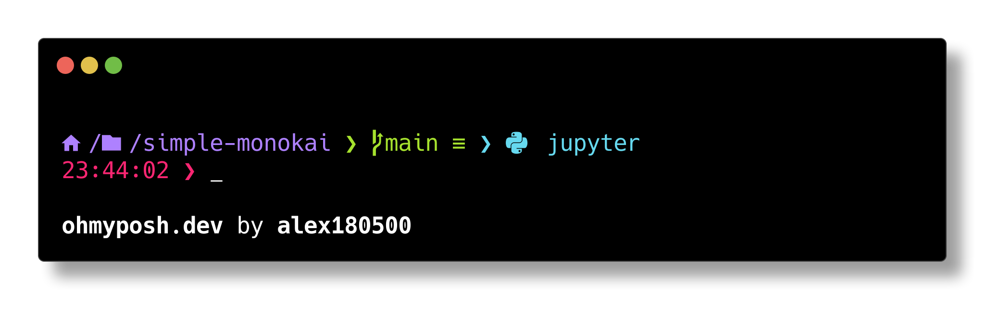

# Simple Monokai

Simple Monokai is a minimal plain theme for **[Oh My Posh](https://ohmyposh.dev/)** with _Python_ and _Git_ integration. Simple Monokai is based upon the default theme **patriksvensson**.

## Installation

First you have to install `oh-my-posh`. Please follow the [Oh My Posh documentation](https://ohmyposh.dev/docs/) for all the steps. Now you can use all the [themes](https://ohmyposh.dev/docs/installation/customize).

You can directly use Simple Monokai without downloading anything by pointing to the github URL:
```pwsh
oh-my-posh init pwsh --config "https://raw.githubusercontent.com/alex180500/simple-monokai/main/SimpleMonokai.omp.json" | Invoke-Expression
```
This way it will always be updated up to the latest version uploaded. Otherwise, you can just download it from the releases and drop it into your desired folder. Please, make sure to have a [Nerd Font](https://www.nerdfonts.com/font-downloads) **3.0.0 or above** installed. Personally, I use _CaskaydiaCove Nerd Font Mono_. Refer to the 

## License

This theme is distributed under [MIT License](LICENSE). If you use my code extensively I would greatly appreciate if you could credit my GitHub profile [`https://github.com/alex180500`](https://github.com/alex180500). **Thanks!**