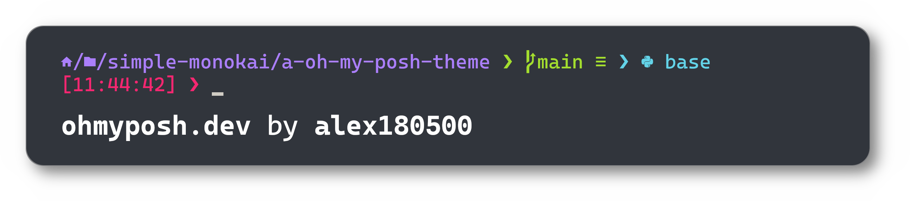

# Simple Monokai

Simple Monokai is a minimal plain theme for **[Oh My Posh](https://ohmyposh.dev/)** with _Python_ and _Git_ integration. Simple Monokai is based upon the default theme [**patriksvensson**](https://ohmyposh.dev/docs/themes#patriksvensson).

## Installation

You can directly use Simple Monokai without downloading anything by pointing to the github URL:
```pwsh
oh-my-posh init pwsh --config "https://raw.githubusercontent.com/alex180500/simple-monokai/main/SimpleMonokai.omp.json" | Invoke-Expression
```
This way it will always be updated up to the latest version uploaded.

If you want it offline you can [**download it from the releases**](https://github.com/alex180500/simple-monokai/releases/latest/download/SimpleMonokai.omp.json) and drop it into your desired folder:
```pwsh
oh-my-posh init pwsh --config "<directory>/SimpleMonokai.omp.json" | Invoke-Expression
```

> [!NOTE]
> Of course, you have to install `oh-my-posh`. Please follow the [Oh My Posh documentation](https://ohmyposh.dev/docs/) for all the steps. Please, make sure to have a [Nerd Font](https://www.nerdfonts.com/font-downloads) **3.0.0 or above** installed. Personally, I use _CaskaydiaCove Nerd Font Mono_.

## License

This theme is distributed under [MIT License](LICENSE). If you use my code extensively I would greatly appreciate if you could credit my GitHub profile [`https://github.com/alex180500`](https://github.com/alex180500). **Thanks!**
